# RiskCore

> **Production-grade insurance core microservices** — 4 Django services + Nginx gateway + Next.js dashboard + Kafka event bus + full observability. Built to demonstrate distributed systems patterns at scale.

[](https://www.python.org/)
[](https://www.djangoproject.com/)
[](https://nextjs.org/)
[](https://kafka.apache.org/)
[](https://www.postgresql.org/)
[](#testing)

---

## What it does

Models the core of an insurance company — policies, claims (with a state machine), async notifications, and an immutable audit log — across 4 Django microservices communicating via Kafka events. A Next.js 15 dashboard consumes both REST and WebSocket to show system state in real time.

| Capability | How it's delivered |
|---|---|
| **Event-driven architecture** | Kafka 3.7 (KRaft), 6 topics, `confluent-kafka` |
| **At-least-once delivery** | **Outbox Pattern** — events written transactionally to DB, relay container publishes to Kafka |
| **Resilient inter-service calls** | **Circuit Breaker** (`pybreaker`) — opens after 5 consecutive failures, fail-fast for 30s |
| **JWT auth + rate limiting** | Nginx gateway with `auth_request` + `limit_req` (anon 20r/m, auth 200r/m) |
| **Real-time frontend** | Next.js 15 (RSC) + WebSocket + **JWT in httpOnly cookies** (never touches JS) |
| **Full observability** | structlog JSON → Loki + Prometheus + 5 Grafana dashboards + 4 alerts |
| **Load tested** | Locust 2.43 — breaking point optimized from **50 → 300 users (6×)** via SEQUENCE refactor |

---

## Architecture

```
                        ┌─────────────────────────┐
                        │  Nginx Gateway :8080    │
                        │  JWT auth + Rate Limit  │
                        └────────────┬────────────┘
                                     │
              ┌──────────────┬───────┴───────┬──────────────┐
              ▼              ▼               ▼              ▼
        ┌──────────┐  ┌──────────┐  ┌──────────────┐  ┌──────────────┐
        │  policy  │  │  claims  │  │    audit     │  │ notification │
        │  :8001   │◀─│  :8002   │  │    :8004     │  │   :8003      │
        │ Gunicorn │  │ Gunicorn │  │ Uvicorn 4w   │  │ Gunicorn+Cel │
        │   4w     │  │   4w     │  │  (ASGI/WS)   │  │              │
        └────┬─────┘  └────┬─────┘  └──────▲───────┘  └──────▲───────┘
             │             │               │                 │
             ▼             ▼               │                 │
        ┌─────────────────────┐            │                 │
        │  OutboxEvent (DB)   │            │                 │
        └─────────┬───────────┘            │                 │
                  ▼                        │                 │
        ┌──────────────────┐    ┌──────────┴─────────────────┴───────┐
        │ Outbox Relay × 2 │───▶│  Kafka — 6 topics                  │
        └──────────────────┘    └────────────────┬───────────────────┘
                                                 │ WS /ws/events/
                                                 ▼
                                       ┌──────────────────────┐
                                       │  Next.js 15 :3001    │
                                       │  Dashboard (RSC+WS)  │
                                       └──────────────────────┘

         Observability: structlog JSON → Loki + Prometheus + Grafana (5 dashboards)
```

---

## Frontend Dashboard

Real-time dashboard at `http://localhost:3001` — server-rendered with Next.js 15 App Router, live events via WebSocket, JWT in httpOnly cookies (never accessible from JS).

### Screenshots

<table>
<tr>
<td width="50%">

**Overview** — aggregated metrics + service health
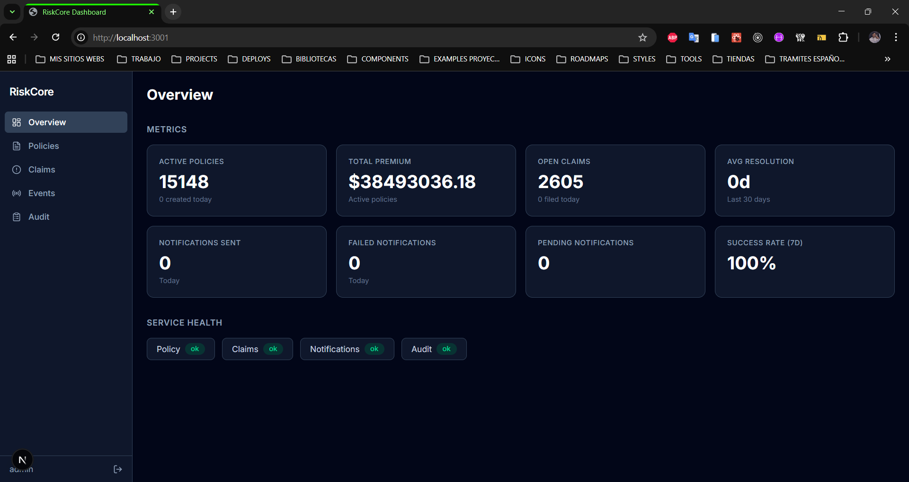

</td>
<td width="50%">

**Live events** — WebSocket streaming with JSON payloads
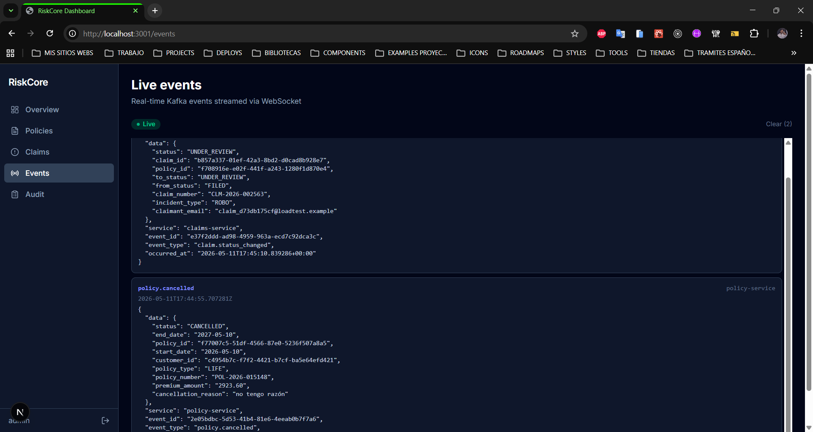

</td>
</tr>
<tr>
<td width="50%">

**Policies** — server-rendered list with filters & pagination
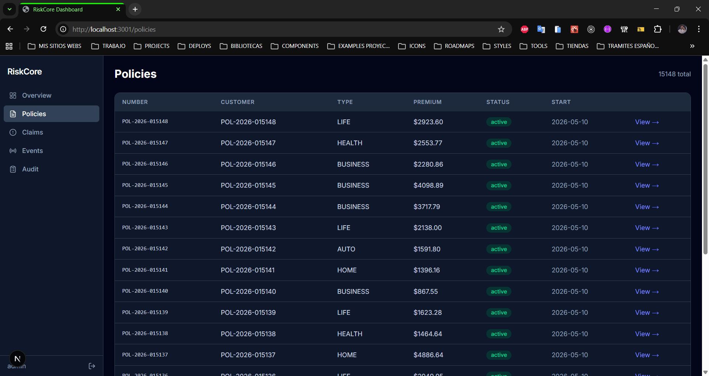

</td>
<td width="50%">

**Claims** — listing with status badges
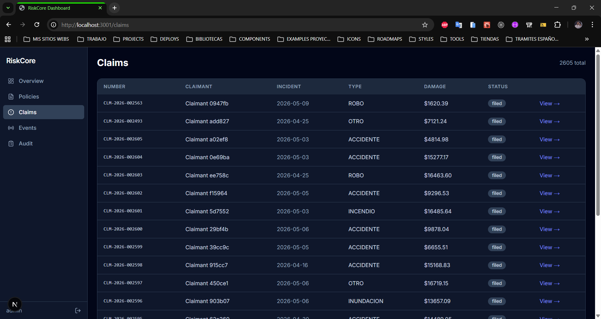

</td>
</tr>
<tr>
<td width="50%">

**Claim state machine** — transition history + CTA
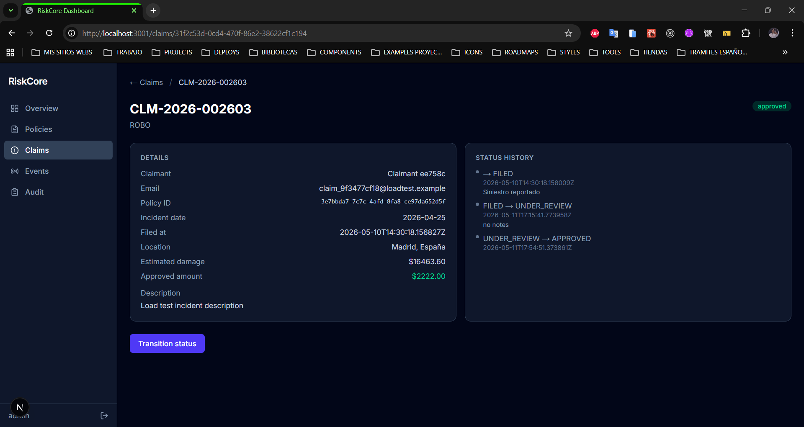

</td>
<td width="50%">

**Audit log** — immutable event log with cursor pagination
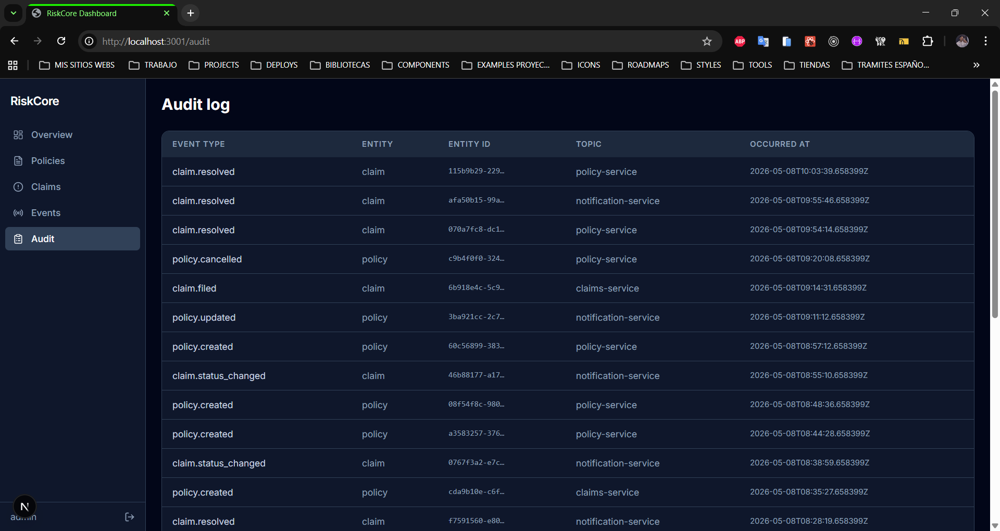

</td>
</tr>
</table>

### Why JWT in httpOnly cookies + Next.js proxy

Most SPAs store JWT in `localStorage` (vulnerable to XSS). RiskCore uses Next.js Route Handlers as an auth proxy:

- **Login** → `/api/auth/login` sets `access_token` as httpOnly cookie. Browser receives only `{ username }`.
- **API calls** → `/api/proxy/[...path]` reads cookie server-side and adds `Bearer` header.
- **Server Components** → read cookie via `next/headers` directly.
- **WebSocket** → fetches a short-lived token from `/api/auth/ws-token` only for the handshake.

Full rationale: [docs/TECHNICAL_DECISIONS.md §26](docs/TECHNICAL_DECISIONS.md).

---

## Resilience Patterns

### Outbox Pattern — at-least-once delivery

Events written to an `OutboxEvent` table in the same DB transaction as the aggregate. A separate relay container polls with `SELECT FOR UPDATE SKIP LOCKED` and publishes to Kafka.

| Before (dual-write) | After (outbox) |
|---|---|
| Kafka down → event lost forever | Kafka down → event stays PENDING, published on recovery |
| DB rollback → producer already fired → phantom event in audit | Outbox row rolls back atomically — consistency guaranteed |

### Circuit Breaker — fail-fast on degraded upstream

`claims-service → policy-service` over HTTP. After 5 consecutive 5xx/timeouts the breaker opens for 30s; 4xx (validation) excluded. Exposes Prometheus metrics (`circuit_breaker_state`) and triggers a Grafana alert.

Full rationale: [docs/TECHNICAL_DECISIONS.md §23–24](docs/TECHNICAL_DECISIONS.md).

---

## Observability in action

Real Grafana dashboards under live traffic — every screenshot below shows the stack handling actual API requests, claims filed through the state machine, policies cancelled, and the gateway rate-limiting abusive clients.

<table>
<tr>
<td width="50%">

**Services Health & Throughput** — 4 services UP + requests/s by service (Policy 7.66 r/s, Claims 5.31 r/s, Notification 3.59 r/s)
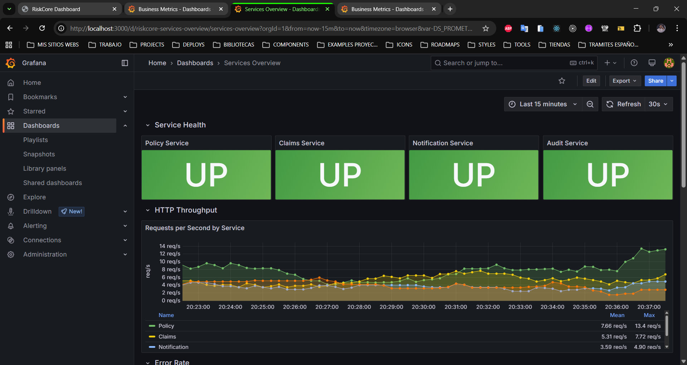

</td>
<td width="50%">

**Request Latency (p50/p95/p99) + Circuit Breaker** — per-service percentiles + CB state for `claims → policy-service`
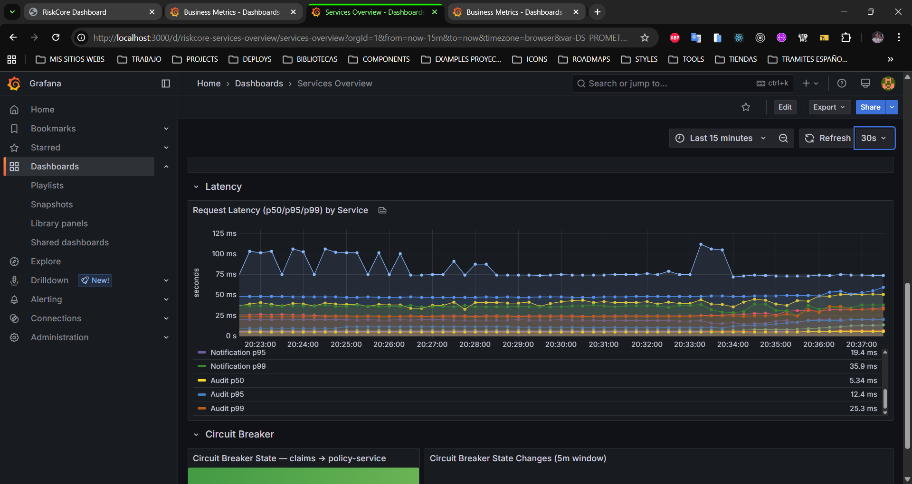

</td>
</tr>
<tr>
<td width="50%">

**Business — Policies** — 101 created / 174 cancelled in 24h + distribution by type (AUTO, BUSINESS, HEALTH)
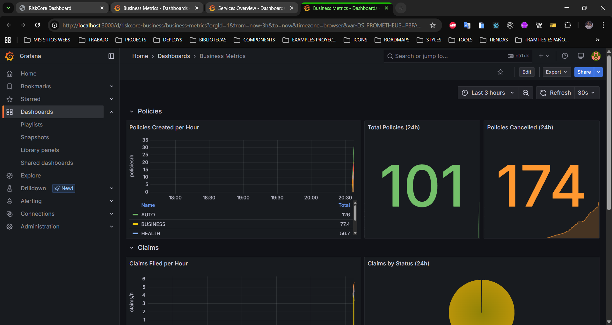

</td>
<td width="50%">

**Business — Claims** — claims filed per hour + state machine distribution (UNDER_REVIEW, APPROVED)
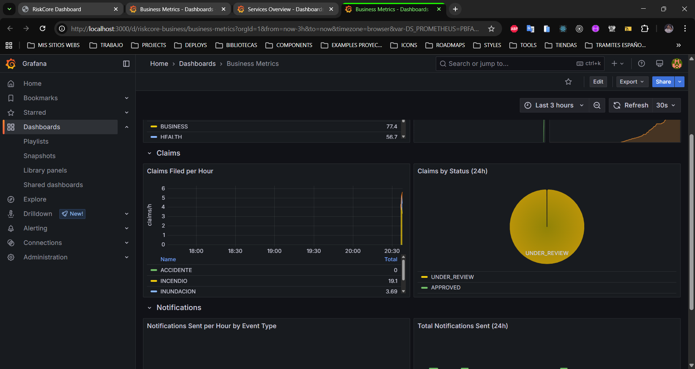

</td>
</tr>
</table>

**Gateway — Rate limiting in action**

The nginx gateway rejecting **953 abusive requests** with `429 Too Many Requests` while letting legitimate traffic through. The 4xx counter (986) is dominated by these rate-limit rejections — a clear signal that the gateway is doing its job under stress.

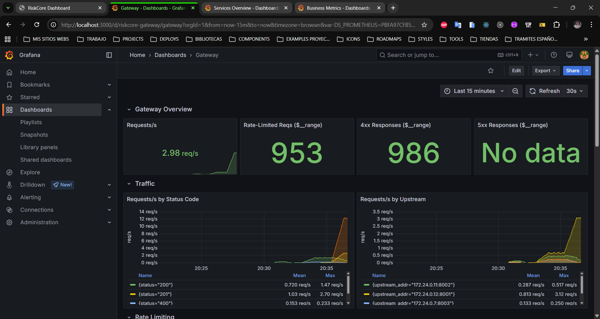

> The full observability stack — Prometheus scrape (4 services + Grafana + Kafka), Loki + Promtail log pipeline, 5 Grafana dashboards (+ Gateway), 4 alerting rules — all provisioned as code in [`infra/grafana/`](infra/grafana/). No clicks in the UI, everything reproducible.

---

## Load Testing — the 6× improvement story

> **Locust 2.43** | Stack: Nginx → 4 Gunicorn services → PostgreSQL 16 + Kafka 3.7
> Numbers below are under **sustained synthetic load** with hundreds of concurrent virtual users. Normal operation shows 0% error rate.

The most interesting technical finding: **replacing pessimistic locking with a PostgreSQL SEQUENCE moved the write breaking point from ~50 to ~300 concurrent users**.

| Metric | Before fix | After fix | Δ |
|---|---|---|---|
| Breaking point (write workload) | ~50 users | ~300 users | **6×** |
| `create_policy` success rate | 0% (all timeouts) | 98.57% | **∞** |
| Aggregated p50 | 30,000ms (timeout) | 1,300ms | **23×** |
| Aggregated p95 | 31,000ms | 5,300ms | **5.8×** |

**Root cause**: `generate_policy_number()` used `Policy.objects.select_for_update()` — every write serialized on a row-level lock under concurrency.

**Fix**: PostgreSQL `SEQUENCE` (`SELECT nextval('policy_number_seq')`) — lock-free, atomic, scales horizontally. Migration: [`policies/0002_policy_number_sequence.py`](policy-service/apps/policies/migrations/).

### Bottlenecks discovered along the way

The full suite (5 scenarios, 50–1000 concurrent users) surfaced additional layers under extreme load — most notably a **PostgreSQL connection pool exhaustion** in `audit-service` that became visible only after migrating Daphne → Uvicorn 4w. The error type shifted from `504 Gateway Timeout` (ASGI queue saturated) to `500 Internal Server Error` (DB pool exhausted), signalling the next optimization target: `CONN_MAX_AGE` + pgBouncer.

The engineering value isn't chasing 100% green — it's **discovering bottlenecks one layer at a time** and root-causing each.

Full scenario-by-scenario report with p50/p95/p99 breakdown, error analysis and the optimization journey: [load-testing-results.md](load-testing-results.md).

---

## Tech Stack

| Layer | Stack |
|---|---|
| **Backend** | Python 3.13 · Django 5.2 + DRF · Channels 4.1 (Uvicorn 4w for ASGI/WS) · Celery 5.4 · `confluent-kafka` · `structlog` · `pybreaker` · `simplejwt` · `uv` · `ruff` |
| **Frontend** | Next.js 15.5 (App Router, RSC default) · TypeScript 5.9 strict · Tailwind 4 · Zustand 5 · Zod 3 · `pnpm` · Vitest 3 |
| **Data** | PostgreSQL 16 (one per service) · Redis 7.2 · Kafka 3.7 (KRaft, 6 topics) |
| **Infra** | Docker Compose (12 containers) · Nginx 1.27 · Locust 2.43 |
| **Observability** | Prometheus · Loki + Promtail · Grafana (5 dashboards + 4 alerts) |

### Services

| Service | Port | Server | Role |
|---|---|---|---|
| policy-service | 8001 | Gunicorn 4w | Customers, policies, JWT issuance |
| claims-service | 8002 | Gunicorn 4w | Claims state machine |
| audit-service | 8004 | Uvicorn 4 workers (ASGI) | Immutable log + WebSocket |
| notification-service | 8003 | Gunicorn + Celery | Async emails |
| gateway | 8080 | Nginx | JWT auth + rate limiting |
| frontend | 3001 | Next.js standalone | Dashboard |

---

## Testing

**251 tests** across 5 services, all passing:

| Service | Tests | Notes |
|---|---|---|
| policy-service | 71 | services ≥97% cov, includes auth + metrics + outbox |
| claims-service | 73 | services ≥96%, state machine + circuit breaker |
| audit-service | 48 | consumer ≥95%, JWT WebSocket middleware |
| notification-service | 39 | tasks 100%, Kafka consumer |
| frontend | 20 | Vitest (apiFetch, wsClient, stores, components) |

Plus **12 integration tests** in the gateway (`bash gateway/test.sh`).

---

## Quick Start

```bash
git clone git@github.com:LucasBenitez7/risk-core.git
cd risk-core
make dev              # 12 containers up
make kafka-setup      # create topics
open http://localhost:3001
```

Default credentials auto-seeded by `policy-service`. Service health on ports 8001–8004.

---

## Documentation

| Document | Description |
|---|---|
| [docs/TECHNICAL_DECISIONS.md](docs/TECHNICAL_DECISIONS.md) | 26 ADRs explaining every technology choice |
| [docs/API_DESIGN.md](docs/API_DESIGN.md) | All endpoints with request/response schemas |
| [load-testing-results.md](load-testing-results.md) | Full load test report with bottleneck analysis |
| [COMANDOS.md](COMANDOS.md) | Development command reference |
| [CONTEXT.md](CONTEXT.md) | Live project state |

---

**Author**: Lucas Benitez · [GitHub](https://github.com/LucasBenitez7) · MIT

_Built as a portfolio project to demonstrate distributed systems patterns and production-grade engineering for Spanish consulting firms._
